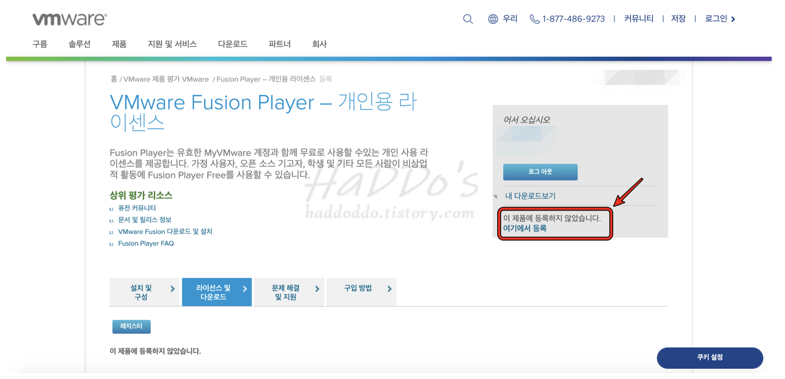

# MAC 에서 Ubuntu VM 생성하기

BigSur에서 VirtualBox 써보려다가 시간만 날리고 VMware로 다시 설치,,,,

VirtualBox 쓰지 마세요 ㅎ

## VMware 다운로드

1. VMware 회원가입
    - [https://my.vmware.com/](https://my.vmware.com/group/vmware/home)
2. VMware 라이센스 받기
    - [https://my.vmware.com/group/vmware/evalcenter?p=fusion-player-personal](https://my.vmware.com/group/vmware/evalcenter?p=fusion-player-personal)

    

3. 계정 등록을 하고 나면 아래에 라이센스 번호 및 다운로드 링크가 생긴다.

    

4. 다운받아서 설치하다가 중간에 발급받은 라이센스 번호 넣어주기

5. 설치 끝

## Ubuntu 다운로드

- [다운로드 Link](https://ubuntu.com/download/desktop)

    

## VMware에서 Ubuntu VM 생성하기

1. Install from disc or image 클릭해서 위에서 다운받은 Ubuntu 파일 선택

    

2. Continue

    

3. 이름, pw 설정해주고 continue

4. Finish 하면 아래와 같이 ubuntu VM 생성 완료

