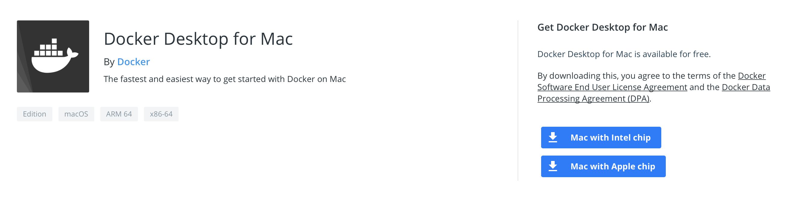

# [MAC] Docker 설치 및 Ubuntu VM 생성

# Docker 설치하기

- 아래 사이트에서 Docker 설치

[https://hub.docker.com/editions/community/docker-ce-desktop-mac/](https://hub.docker.com/editions/community/docker-ce-desktop-mac/)



# Hello-World

- Terminal 을 열어 아래 코드 작성하여 테스트

```docker
docker run hello-world

# 실행 결과
Unable to find image 'hello-world:latest' locally
latest: Pulling from library/hello-world
b8dfde127a29: Pull complete 
Digest: sha256:5122f6204b6a3596e048758cabba3c46b1c937a46b5be6225b835d091b90e46c
Status: Downloaded newer image for hello-world:latest

Hello from Docker!
This message shows that your installation appears to be working correctly.

To generate this message, Docker took the following steps:
 1. The Docker client contacted the Docker daemon.
 2. The Docker daemon pulled the "hello-world" image from the Docker Hub.
    (amd64)
 3. The Docker daemon created a new container from that image which runs the
    executable that produces the output you are currently reading.
 4. The Docker daemon streamed that output to the Docker client, which sent it
    to your terminal.

To try something more ambitious, you can run an Ubuntu container with:
 $ docker run -it ubuntu bash

Share images, automate workflows, and more with a free Docker ID:
 https://hub.docker.com/

For more examples and ideas, visit:
 https://docs.docker.com/get-started/
```

- 귀여운 고래 만들기

```docker
docker run docker/whalesay cowsay 'hello world!'

# 실행 결과
 ______________ 
< hello world! >
 -------------- 
    \
     \
      \     
                    ##        .            
              ## ## ##       ==            
           ## ## ## ##      ===            
       /""""""""""""""""___/ ===        
  ~~~ {~~ ~~~~ ~~~ ~~~~ ~~ ~ /  ===- ~~~   
       \______ o          __/            
        \    \        __/             
          \____\______/
```

# Docker 에서 Ubuntu 실행하기

1. 우분투 이미지 설치 및 bash 실행
    - 아래 명령어를 입력하면 'hello' 라는 이름을 가진 컨테이너를 생성하고 실행하게 됨
    - —name hello 부분 생략할 경우 Docker 마음대로 이름 생성
    - -i: interactive / -t: Pseudo-tty

        ```docker
        docker run -it --name hello ubuntu /bin/bash

        # 실행 결과
        # Pull Ubuntu image
        Unable to find image 'ubuntu:latest' locally
        latest: Pulling from library/ubuntu
        345e3491a907: Pull complete 
        57671312ef6f: Pull complete 
        5e9250ddb7d0: Pull complete 
        Digest: sha256:adf73ca014822ad8237623d388cedf4d5346aa72c270c5acc01431cc93e18e2d
        Status: Downloaded newer image for ubuntu:latest

        # Execute Ubuntu
        root@3417f434f668:/#
        ```


* Ubuntu 환경 설정

- gcc version 업데이트

    ```docker
    apt-get update
    apt-get install gcc
    ```

2. 컨테이너 종료하기

- exit 입력시 종료

```docker
exit
```