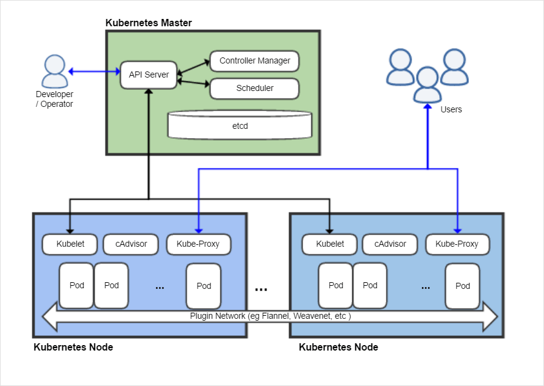

# What is Kubernetes?

### 들어가기에 앞서...

쿠버네티스는 개발자의 필요에 의해 만들어진 기술로, 이를 사용하는 입장에서 플랫폼을 바라보는 시각과 시스템의 원론을 바라보는 시각에서의 난이도 차이가 상당한 것으로 보여요. 준비를 하면서 더 low-level에서부터 이해해보려 했는데, 그보다는 실제로 쿠버네티스가 제공하는 각 기능들을 사용해 보면서 몸에 와닿는 것이 더 강력한 학습이 될 수 있을 것 같습니다. (실제로 책의 글과 [kubernetes.io](http://kubernetes.io)의 documentation, 개인 블로그 정리 글 모두 찾아 읽어도 쉽게 이해되지 않는 부분도 많아서..)

그런 의미에서 이 장에서는 나중에 몸으로 느끼게 될 것들을 미리 눈과 귀에 익혀두는 시간을 갖는 정도로 생각하고 뒷 장에서 실습을 진행하면서 잠깐씩 앞으로 돌아와 설명을 다시 한 번 봐도 좋을 듯 합니다. 🙂

## Container Orchestration

가상화된 독립 실행 환경을 구성할 수 있게 도와주는 컨테이너를 다수의 서버 위에서 안정적으로 실행 될 수 있게 관리해주는 플랫폼이다.

Docker 예제에서 컨테이너를 직접 다루는 경험을 해봤는데, 이는 하나의 노드에서 컨테이너를 실행시키고 관리하는 간단한 실습이었다. 수많은 서버 머신에서 사용자가 원하는 컨테이너의 실행 환경과 상태 등을 실시간적으로 관리하는 것은 그것과는 다른 문제일 것이고, 이를 도와주는 플랫폼으로 해석된다. 

쿠버네티스는 Container Orchestraion Tool 중 하나이고, 이 외에도 `Docker Swarm` , `Apache Mesos` 와 같은 툴이 있다. 

Kubernetes는 다음과 같은 기능을 가진다. (Container Orchestration의 기능인지, Kubernetes의 기능인지 불명확함 ㅠ)

- 노드 클러스터링
- 컨테이너 노드 밸런싱
- 컨테이너 배포/복제 자동화
- 컨테이너 장애 복구 기능(자가 치유) - Self Healing
    - Conatiner 가 실행되지 않거나 죽어버리는 등 문제가 생겼을 때 자동으로 복구하는 기능. Desired State를 유지하도록 지원한다.
- 컨테이너 자동 확장 및 축소 - Automatic Binpacking
    - 가용성을 해치지 않는 선에서 리소스를 충분히 활용해 Pod을 자동으로 배치한다. (Pod은 컨테이너를 실행하는 최소 단위로 볼 수 있음.)
- 컨테이너 스케쥴링
- 로깅 및 모니터링

## Then, what is Kubernetes?

위의 설명과 같이 쿠버네티스는 여러 노드로 구성되어있는 클러스터 위에서 컨테이너의 Life Cycle을 관리하는 역할을 한다. 노드는 Master와 Worker로 구분되는데, Master는 Kubernetes cluster를 운영하는 compent가 있고, worker(kubernetes node, minion 등의 이름으로도 불림)는 container를 실행시키고 master와 통신하며 컨테이너를 관리하는 component 등이 있다.

## Kubernetes Master

마스터는 다음의 컴포넌트로 구성된다.

### kube-apiserver

여러 머신과 component로 구성된 kubernetes cluster가 서로간의 통신을 할 수 있게 하는 component이다. HTTP/HTTPS REST API를 이용해 호출된다. 아래의 그림을 보면 모든 요청은 API Server를 거쳐 서로 다른 component에게 전달되는 것을 확인 할 수 있다. (bound pod 같은 요청의 상세한 기능은 아직 모르겠다..)

kubectl(Kubernetes Command-line Tool)을 통해 사용자가 k8s를 이용하는 것 또한 master의 API server와 REST API를 호출하는 형태로 수행된다. 

### kube-controller-manager

k8s의 리소스들은 각각을 제어하는 controller가 개별적으로 존재한다. Pod의 복제와 배포를 변경하는 명령을 수행하고 Pod 상태를 관리하는 ReplicaSet, Deployment 등의 Controller를 제어하면서 Pod의 상태를 **Desired State** 로 관리하게 도와준다. 

### kube-scheduler

클러스터 환경 위에서 container가 잘 실행되고 있는지 확인한다. 새로운 Pod이 생성되어 실행하게 된다면 어떤 Node에서 실행할지 결정하는 역할을 맡고, Node별 resource에 맞춰 conatiner를 배치한다.

### etcd (저장소)

k8s의 모든 데이터를 저장하는 곳으로 볼 수 있다. 분산형 key-value 저장소로, ***클러스터의 모든 설정, '상태' 데이터를 저장한다.*** etcd가 존재하기 때문에 master가 살아있다면 모든 worker가 죽더라도 그 상태 그대로 cluster의 상태를 보존하고 복구할 수 있다. 고가용성을 위해 etcd 클러스터를 구축하여 안정성을 높일 수 있다. 

### DNS (Domain Name System)

내부의 리소스 end-point를 매핑하고 관리하는 시스템. 동적으로 생성되는 Pod과 서비스들은 ip를 배정받아 internal IP가 생성되어 DNS 서버에 저장된다. 

## Kuberneetes Node (alias. worker node, node, etc.)

Master의 명령을 받아 워크로드를 생성하고 이를 실행하는 component이다. Worker node를 구성하는 component는 다음과 같다. 

### kubelet (노드 관리자)

각 노드에서 실행되는 메인 컴포넌트. Master와 실시간으로 통신하면서 수행해야 할 명령을 API 서버를 통해 받고, 제공받은 spec에 맞춰 pod을 실행한다. Pod의 life-cycle을 관리하며 `desired state`를 유지시키고, 이상 동작을 감지하고 상태를 master에게 전달한다. 이 외에도 node의 상태 정보나 리소스 사용량, 컨테이너의 로그 등을 전달하는 역할도 한다. 

### kube-proxy (네트워크 프록시)

Node에 할당 되어있는 pod로 연결되는 네트워크를 관리한다. 

노드로 오는 트래픽을 적절한 container로 프록시하고, 노드와 마스터 사이의 네트워크 통신 관리. 클러스터의 내/외부의 네트워크를 적절하게 load balacing 하며 pod으로 전달해주는 역할을 한다.

### Container Runtime

`도커`다. 실제로 컨테이너를 실행시키는 역할을 하며, 도커 이외에도 다른 컨테이너 런타임을 사용 할 수 있다.

## 장점?!

- 실행환경 고립화 (이건 컨테이너/도커 의 장점으로 볼 수 있지 않나?)
- 리소스 관리의 용의성
- Cluster Scheduling
- 프로세스 관리 - 각 Node에 접근하지 않아도 Master에서 모든 프로세스를 관리할 수 있음.
- 통합 설정 관리 - Master의 etcd에서 설정을 통합해 관리할 수 있다.
- 손쉬운 장애 대응 - 프로세스 별 리소스 사용량 제어가 가능하고, 하나의 서버가 문제가 생겼을 때 다른 서버로 분산시켜 처리하는 것이 용이하다.
- 자동 확장 - 리소스가 부족한 경우에 최소한의 자원으로 유지하다 필요에 의해 리소스를 추가하는 것이 가능하다.
- 하이브리드 클라우드 운영 - on premise와 cloud platform 위에서 변화 없이 구축이 가능해 기술 스택이 단순화 된다.
- 자가 치유
- 데이터 저장소 관리 - 로컬 저장소 관리가 쉽고 네트워크 저장소 연결 기능이 잘 되어있다고 한다.
- 배포 자동화 - Continuous Integration/Deployment를 지원해 개발자가 들이는 수고가 줄어든다.

## 추가적으로..

### Pod이란?

k8s의 가장 작은 배포 단위이다. 다음과 같은 특징을 갖고있다.

- 1개의 Pod은 내부에 여러개의 컨테이너를 가질 수 있지만 대부분 1~2개의 컨테이너를 갖게된다.
- 1개의 Pod은 여러 개의 물리 서버에 나뉘지 않고 하나의 물리 서버(Node)에 올라간다.
- Pod 내부의 컨테이너들은 네트워크와 볼륨을 공유해 localhost로 통신할 수 있다.
- Pod은 클러스터 내에서 사용할 수 있는 유니크한 네트워크 ip를 할당 받지만 이 ip는 서비스에서 사용하지 않는다. 이는 K8s에서 Pod은 언젠가는 반드시 죽는(mortal) 오브젝트이기 때문이다. 이후에 설명하겠지만 Service라는 오브젝트에서 죽기도하고 또 다시 살아나기도 하는 Pod의 Endpoint를 관리하고 Pod의 외부에서는 이 ‘Service’ 를 통해 Pod에 접근하게 된다. ( ~~← 이해가 안되는데 나중에 언젠간 이해가 될까봐 일단 적어뒀습니다.~~)
- 동일한 작업을 수행하는 Pod은 ResplicaSet이라는 Controller에 의해 정해진 룰에 따라 복제된다. 이때 여러개의 Pod이 여러 Node에 나뉘어 실행 될 수 있다.